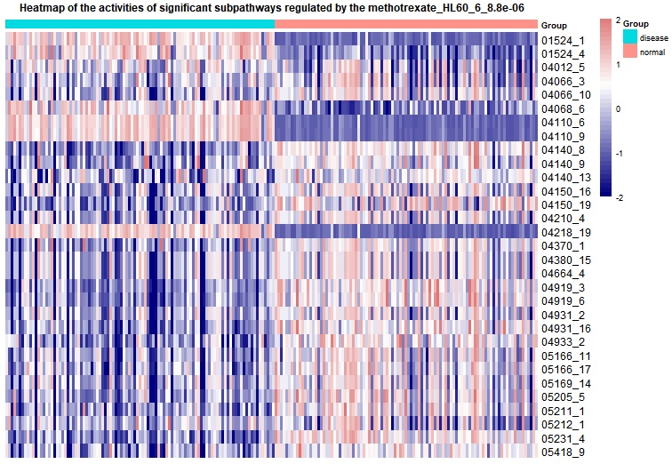

```{r , include = FALSE}
library(DRviaSPCN)
```

### <font face="微软雅黑"> Introduce </font>
<font face="微软雅黑"> We developed a novel software package (DRviaSPCN) that enables repurposing drugs via a subpathway (SP) crosstalk network. The main process include construction of the SP network and calculation of the centrality scores of SPs to reflect the influence of SP crosstalk, calculating the enrichment score of subpathways and weighting them with corresponding centrality score to get weighted enrichment score(weighted-ES), calculation of enrichment scores of drug- and disease-induced dysfunctional SPs and weighted them by the centrality scores of SPs, evaluation of the drug-disease reverse association at the weighted SP level, identification of cancer candidate drugs. There are also several functions used to visualize the results such as visualization of the subpathway network structure of interest, chemical molecular formula of the drug or compound, and heatmap of the expression of subpathways in different sample types.

This vignette illustrates how to easily use the **DRviaSPCN package**. Here, with the use of functions in this package, users could identify potential therapeutic drugs for disease through estimating drug-disease reverse association.

**The method consists of three parts:**

**1.Evaluating influence of SP crosstalk.** 
 We think two SPs are functionally related if there are some genes in two SPs that share at least more than one common biological function (GO term). To analyze the influence of SP crosstalk, we first construct a weighted SP/GO bipartite network. We defined an edge between a SP and a Go term if they have at least one common gene. For a certain disease, we used the different level of the shared genes between two types of samples (disease and normal), and the Jaccard index between a pair of SP and go term to define the weight of the edge. Next, we constructed a SP-SP network based on the SP-GO network. Similarly, we defined an edge between two subpathways if they have at least a common biology function. After the above steps, a SP-SP network induced by disease could be constructed. Then, we applied random walk algorithm to the SP-SP network to calculate eigenvector centrality score of SPs which can reflect the influence of SP crosstalk. Finally, the statistical significance (p-value) of these centrality scores was assessed using a bootstrap-based randomization method. In the same way, the eigenvector centrality score and p-value of SPs induced by each drug can also be calculated.

**2.Evaluating drug-disease reverse association based on disease- and drug-induced SPs weighted by the SP crosstalk.**
 In this part, CMap build 02 raw data was downloaded from the CMap website (Lamb et al. 2006). After constructing gene expression profiles, the Gene Set Enrichment Analysis (GSEA) was used to calculate the enrichment score of SPs For a disease, we applied the GSEA method to the gene expression profile of the disease. After calculating the enrichment score (*ES*) of SPs, we weighted them with corresponding centrality scores to calculate weighted enrichment score (weighted-ES). In the same way, the weighted enrichment score (weighted-ES) of SPs induced by each drug can also be calculated. We defined a drug-disease reverse association score (*RS*) to reflect the treatment extent of a drug at the SP level. For each drug and certain disease, the SPs were ranked in descending order based on the corresponding weighed-ES. We mapped the up-and down-regulated subpathways induced by disease to the ranked list of SPs induced by each drug to calculate the *ks.up* and *ks.down*. And the *RS* is equal to *ks.up - ks.down*.

**3.Identifying statistically significant disease-candidate drugs.**
 Generally, a drug was applied with different instances (different concentrations, cancer cell lines or duration), we thus calculated the RS for each instance of all drugs. After normalization, a ranked instance list was constructed according to the normalized scores of all instances. For a given drug, the instance set of the drug was extracted and mapped to the ranked list, and the Kolmogorov-Smirnov statistic was used to compute the drug enrichment score (DES) based on the instance set. If the instance set of the drug enriches at the negative RS region of the list, the DES will be strong negative indicating the drug in different instances may have consistent treatment effect on the disease. To estimate the statistical significance (empirical p-values) of the DES, we randomly selected the same number of instances for the drug to recalculate the DES, and we repeated this process N times. The p-value was then calculated as p-value = M/N, where M is the number of randomly selected DESs less than the observed DES. In the package, the default randomly selected times are set at 1000. To correct for multiple comparisons, we adjusted the empirical p-values of drugs using the false discovery rate (FDR) method 

  
+  This package provides the `CalCentralityScore` function to calculate the centrality score of subpathways and the corresponding p-value.  

+  This package provides the `Optimaldrugs` function to calculate the DES of drugs and corresponding p-value.
  
+  This package provides the `plotSPW` function to plot SP network structure.

+  This package provides the `getMolecularFM` function to plot the chemical molecular formula of the drug or compound.

+  This package provides the `Disease2SPheatmap` function to plot heatmap of the activities of subpathways in different sample types that are regulated by disease.

+  This package provides the `Drug2SPheatmap` function to plot heatmap of the activities of subpathways in different sample types that are regulated by drugs.
  
+  This package provides the `GetExample` function to return example data and environment variables, such as gene expression profile, sample label and so on.</font>

In addition, the essential data `DrugSPESCMatrix` and `DrugSPPvalueMatrix` which are subpathways weighted-ES induced by all drugs and statistic significance (p-value) of centrality score of subpathways regulated by all drugs were stored in our DRviaSPCNData package. Users could download and use this package by the following code:

```{r eval=FALSE}
### Download DRviaSPCNData package from GitHub
library(devtools)
install_github("hanjunwei-lab/DRviaSPCNData",force = TRUE)
library(DRviaSPCNData)
### Get weighted-ES of subpathways
DrugSPESCMatrix<-GetData("DrugSPESCMatrix")
### Get p-value of subpathways centrality score
DrugSPPvalueMatrix<-GetData("DrugSPPvalueMatrix")
```


*****
### <font face="微软雅黑">Example 1 : Calculating the centrality scores of subpathways. </font>

<font face="微软雅黑">  The function "CalCentralityScore" was used to calculate the centrality scores of SPs to reflect the crosstalk influence, which were used as weights in the calculation of drug-disease reverse association score. 

The commands are as follows: </font>

```{r,message=FALSE}
###Load depend package
library(igraph)
###Obtain input data
GEP<-GetExample('GEP')# Get the gene expression profile
Slabel<-GetExample('Slabel')# Get the sample class label
```
```{r eval=FALSE}
###Run the function
CentralityScoreResult<-CalCentralityScore(ExpData=GEP,Label=Slabel,nperm = 1000)


```
```{r echo=FALSE}
###Get the result of this function
CentralityScoreResult<-GetExample('CentralityScoreResult')
```
```{r}
###view first ten subpathways result
CentralityScoreResult[1:10,c(1,3,5,6,7)]


```


*****

### <font face="微软雅黑"> Example 2 : Calculating the drug-disease reverse association score and corresponding pvalue of drugs. </font>

<font face="微软雅黑"> The function `Optimaldrugs` is used to calculate the *DES* and statistic significance of drugs. The detailed algorithm can be seen in the introduction part. Users could screen out the optimal therapeutic drugs according to a specific threshold. Here we provide weighted and unweighted methods to calculate the score, which can be selected by parameters *weight = ''* . The screening criteria of the up- and down-regulated subpathways can be changed through the parameters *pcut = ''* and *topcut = ''*.
The commands are as follows: </font>

```{r,eval=FALSE}

###Run the function
Opdrugresult<-Optimaldrugs(ExpData=GEP,Label=Slabel,DrugSPESC=DrugSPESCMatrix,
              CentralityScore=CentralityScoreResult,nperm=1000,topcut=10,
              pcut=0.01,weight=FALSE)

```
```{r echo=FALSE}
###Get the result of this function
Opdrugresult<-GetExample('Opdrugresult')
```
```{r}
###view first ten drugs result
head(Opdrugresult,10)
```

*****

### <font face="微软雅黑"> Visualize 1: Plot a subpathway network structure graph. </font>

<font face="微软雅黑">  The function `plotSPW` used to plot a subpathway network structure graph. The user just needs to input an interest subpathway id such as "00020_4".

The commands are as follows: </font>

```{r,message=FALSE,fig.width=7,fig.height=5}
###load depend package
library(igraph)
###plot network graph of the subpathway "00020_4"
plotSPW("00020_4")

```

*****

## <font face="微软雅黑"> Visualize 2: Plot a chemical molecular formula of the drug or compound .</font>

#####
<font face="微软雅黑">  The function `getMolecularFm` can obtain a chemical molecular formula of the drug or compound. Then users could visualize the molecular formula through function "plot".
  
The commands are as follows:  </font>

```{r,results='hide',message=FALSE,fig.width=7,fig.height=5}
###Load depend package
library(ChemmineR)
library(rvest)
###Obtain molecular formula and visualize it
Mole_formula<-getMolecularFm(drugname ="methotrexate")
plot(Mole_formula)

```

*****

## <font face="微软雅黑"> Visualize 3: Plot a heatmap of the subpathways that are regulated by disease.</font>

#####
<font face="微软雅黑">  The function `Disease2SPheatmap` plots a heat map of the subpathways that are regulated by disease. The input is the result of function `CalCentralityScore`, disease gene expression profile and sample class in the expression profile. We map subpathways to the disease gene expression through ssgsea to get a subpathway abundance matrix. Then we visualize the matrix by heatmap. Users could change the threshold that is used to screen significant subpathways through the param *pcut*.
  
The commands are as follows:  </font>

```{r,message=FALSE,results='hide',fig.width=7,fig.height=5}
###Load depend package
library(GSVA)
library(pheatmap)

###Run the function
Disease2SPheatmap(CentralityScore=CentralityScoreResult,ExpData=GEP,Label=Slabel,pcut=0.05,
                   bk=c(-2,2),cluster.rows=FALSE,cluster.cols=FALSE,
                   show.rownames=TRUE,show.colnames=FALSE,
                   col=c("navy","firebrick3"),cell.width=NA,
                   cell.height=NA,scale="row",fontsize=7,
                   fontsize.row=9,fontsize.col=10)
```

*****

## <font face="微软雅黑"> Visualize 4: Plot heatmaps of the subpathways that are regulated by drugs.</font>

#####
<font face="微软雅黑">  The function `Drug2SPheatmap` plots heatmaps of the subpathways that are regulated by drugs. The function input is a character which is drug name, disease gene expression profile and sample class in the expression profile. We map subpathways to the disease gene expression through ssgsea to get a subpathway abundance matrix. Then we visualize the matrix by heatmap. Users could change the threshold that is used to screen significant subpathways through the param *pcut*. The result of this function is a list including all heatmaps.
  
The commands are as follows:  </font>

```{r,eval=FALSE}
###Load depend package
library(GSVA)
library(pheatmap)
###Run the function
Drug2SPheatmap(drugname="methotrexate_HL60_6_8.8e-06",
              DrugSPPvalue=DrugSPPvalueMatrix,ExpData=GEP,
              Label=Slabel,pcut=0.05,bk=c(-2,2),cluster.rows=FALSE,
              cluster.cols=FALSE,show.rownames=TRUE,
              show.colnames=FALSE,col=c("navy","firebrick3"),
              cell.width=NA,cell.height=NA,scale="row",
              fontsize=6,fontsize.row=9,fontsize.col=10)


```

```{R,echo=FALSE}

```
